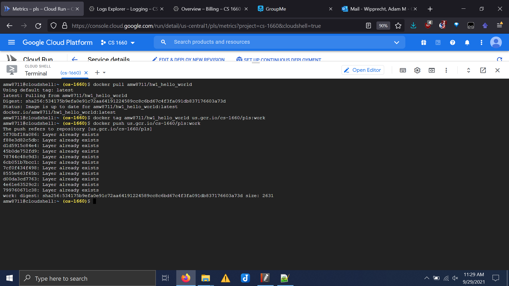
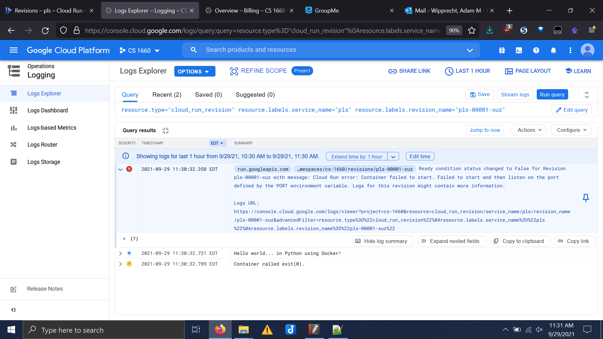
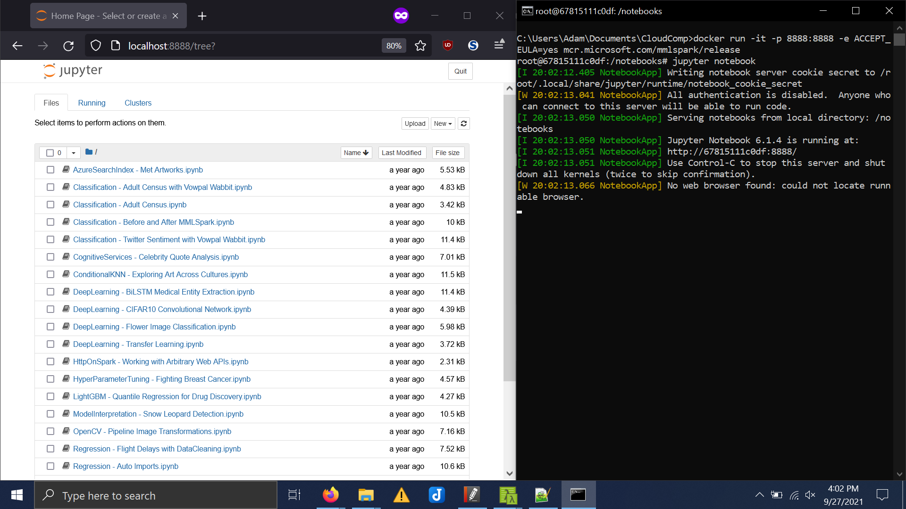
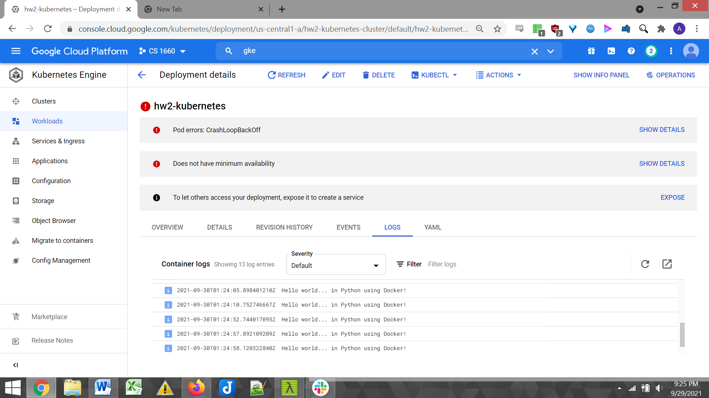

# CS1660_HW2
University of Pittsburgh CS 1660 Cloud Computing Homework 2 involving Docker, Kubernetes, and Google Cloud Platform

## Part 1

1. This is the link to the "Hello World" Docker image made by me and available on Docker Hub.

https://hub.docker.com/repository/docker/amw8711/hw1_hello_world

2. The first screenshot shows the Docker commands used to 
- Pull the container image from Docker Hub onto the Google Cloud Shell VM
- Tag the container for use on Google's Container Registry
- Push the Docker image to the Container Registry for use in the cloud



The second screenshot shows the container's output after being run on GCP.



3. Below are the contents of the Dockerfile and the Python file used to make the container.

### [Dockerfile](Dockerfile)

```
FROM python:3.9.7
COPY . /usr/src/hw1
WORKDIR /usr/src/hw1
CMD ["python3", "hello_world.py"]
```

### Source file ([hello_world.py](hello_world.py))

```py
print("Hello world... in Python using Docker!")
```

## Part 2

Here is the screenshot of running the MMLSpark image.



## Extra Credit

Here is a screenshot of a Kubernetes cluster on GCP running the Docker image.


