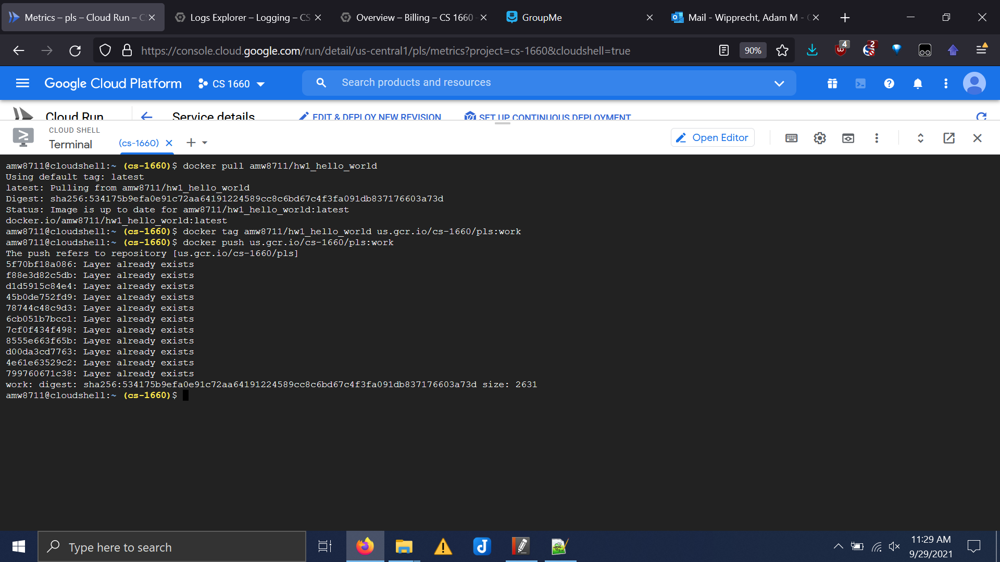

# CS1660_HW2
University of Pittsburgh CS 1660 Cloud Computing Homework 2 involving Docker, Kubernetes, and Google Cloud Platform


## Part 1

1. 
https://hub.docker.com/repository/docker/amw8711/hw1_hello_world

2. 

3.

### Dockerfile

```
FROM python:3.9.7
COPY . /usr/src/hw1
WORKDIR /usr/src/hw1
CMD ["python3", "hello_world.py"]
```

### Source file (hello_world.py)

```py
print("Hello world... in Python using Docker!")
```